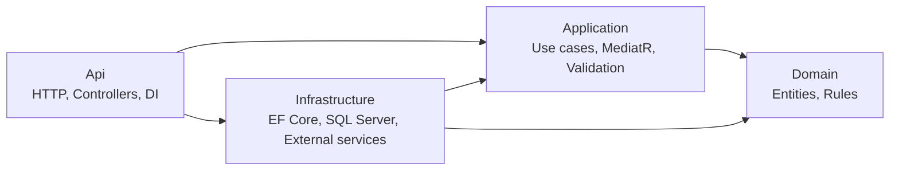

# Clean Architecture Skeleton Guide

Эта инструкция нужна как учебный маршрут для ручной реализации архитектурного скелета CardLearning.

Цель: не просто разложить файлы по папкам, а понять, зачем нужен каждый слой, какие зависимости допустимы, где живет business logic, где живет EF Core и как тестировать архитектуру без лишнего boilerplate.

## 1. Подготовь решение

Сначала зафиксируй текущее состояние и убедись, что проект собирается до архитектурных изменений.

Рекомендуемые действия:

1. Создай новую git-ветку, например `codex/clean-architecture-skeleton`.
2. Выполни `dotnet build CardLearningAPI/CardLearningAPI.sln`.
3. Если build уже падает до твоих изменений, сначала зафиксируй причину падения в заметках.
4. Не начинай с EF Core, MediatR и migration одновременно. Сначала приведи solution structure в порядок.

Планируемые проекты:

```text
CardLearning.Api
CardLearning.Application
CardLearning.Domain
CardLearning.Infrastructure
CardLearning.Api.Tests
CardLearning.Application.Tests
CardLearning.Infrastructure.Tests
```

Текущий проект `Dom` нужно переименовать концептуально в `CardLearning.Domain`.

Текущий проект `CardLearningAPI` нужно переименовать концептуально в `CardLearning.Api`.

## 2. Настрой зависимости между проектами

Главное правило Clean Architecture: зависимости смотрят внутрь, к Domain.

Правильная схема:

```text
CardLearning.Api -> CardLearning.Application
CardLearning.Api -> CardLearning.Infrastructure

CardLearning.Infrastructure -> CardLearning.Application
CardLearning.Infrastructure -> CardLearning.Domain

CardLearning.Application -> CardLearning.Domain

CardLearning.Domain -> ни от кого
```

Проверь себя:

1. `Domain` не должен ссылаться на ASP.NET Core, EF Core, MediatR, FluentValidation или Infrastructure.
2. `Application` не должен ссылаться на `Infrastructure`.
3. `Infrastructure` может знать про EF Core, SQL Server, migrations и concrete implementations.
4. `Api` является composition root: там собирается dependency injection и HTTP pipeline.

Ментальная модель:



## 3. Перенеси Domain

Domain слой должен описывать предметную область приложения: карточки, группы карточек, учебные сессии, будущий прогресс.

На первом этапе используй такие базовые сущности:

```text
Deck
Card
LearningSession
```

Решение по терминологии:

1. Используем `Deck`, а не `Topic`.
2. `Deck` - группа карточек для изучения темы.
3. `Card` - одна карточка с front/back content.
4. `LearningSession` - попытка пользователя пройти набор карточек.

Что сделать:

1. Переименуй `Topic` в `Deck`.
2. Удали или отложи `User.Password`, потому что users/auth будут делаться позже через OpenID Connect.
3. Сделай entity nullable-safe: строки должны быть `required`, nullable или иметь protected/private constructor strategy.
4. Не добавляй EF Core attributes в Domain без необходимости.
5. Не добавляй `DbContext` в Domain.

Пример направления, не обязательно копировать дословно:

```csharp
namespace CardLearning.Domain.Decks;

public sealed class Deck
{
    public int Id { get; set; }
    public required string Name { get; set; }
    public string? Description { get; set; }
    public bool IsPublic { get; set; }
    public ICollection<Card> Cards { get; set; } = [];
}
```

Важная мысль: Domain не обязан быть идеальным DDD с первого дня. Но он не должен быть просто случайным набором EF classes без смысла.

## 4. Создай Application слой

Application слой отвечает за use cases: что пользователь или система хочет сделать.

Примеры будущих use cases:

```text
CreateDeck
GetDeckById
AddCardToDeck
StartLearningSession
CompleteLearningSession
```

На первом архитектурном шаге достаточно заложить структуру и один простой пример command/query.

Рекомендуемая структура:

```text
CardLearning.Application
  Common
    Behaviors
    Interfaces
  Decks
    Commands
    Queries
```

Добавь packages:

```text
MediatR
FluentValidation
FluentValidation.DependencyInjectionExtensions
```

Создай `IAppDbContext`:

```csharp
using CardLearning.Domain.Decks;
using Microsoft.EntityFrameworkCore;

namespace CardLearning.Application.Common.Interfaces;

public interface IAppDbContext
{
    DbSet<Deck> Decks { get; }
    DbSet<Card> Cards { get; }
    DbSet<LearningSession> LearningSessions { get; }

    Task<int> SaveChangesAsync(CancellationToken cancellationToken = default);
}
```

Архитектурный trade-off:

1. `IAppDbContext` проще, чем specific repositories.
2. Он не прячет EF Core полностью, потому что Application видит `DbSet<T>`.
3. Зато мы не делаем `Generic Repository`, который часто ломает выразительность EF Core.
4. Если позже появятся сложные domain операции, можно добавить specific repository, например `IDeckRepository`.

Добавь `ValidationBehavior<TRequest, TResponse>`:

```text
MediatR request -> FluentValidation validators -> Handler
```

Смысл: handler не должен начинаться с десяти проверок входной модели. Validation pipeline отсекает invalid request раньше.

Добавь extension method:

```csharp
public static IServiceCollection AddApplication(this IServiceCollection services)
```

В нем зарегистрируй:

1. MediatR handlers из Application assembly.
2. FluentValidation validators из Application assembly.
3. Pipeline behavior для validation.

## 5. Создай Infrastructure слой

Infrastructure слой содержит детали, которые можно заменить без переписывания business rules.

Сюда относятся:

```text
EF Core DbContext
SQL Server provider
Migrations
Entity configurations
External services
File storage
Email providers
```

На первом этапе нужны EF Core и SQL Server.

Добавь packages:

```text
Microsoft.EntityFrameworkCore
Microsoft.EntityFrameworkCore.SqlServer
Microsoft.EntityFrameworkCore.Design
```

Создай `CardLearningDbContext`:

```csharp
public sealed class CardLearningDbContext : DbContext, IAppDbContext
{
    public CardLearningDbContext(DbContextOptions<CardLearningDbContext> options)
        : base(options)
    {
    }

    public DbSet<Deck> Decks => Set<Deck>();
    public DbSet<Card> Cards => Set<Card>();
    public DbSet<LearningSession> LearningSessions => Set<LearningSession>();

    protected override void OnModelCreating(ModelBuilder modelBuilder)
    {
        modelBuilder.ApplyConfigurationsFromAssembly(typeof(CardLearningDbContext).Assembly);
    }
}
```

Создай EF configurations через `IEntityTypeConfiguration<T>`.

Рекомендуемая структура:

```text
CardLearning.Infrastructure
  Persistence
    CardLearningDbContext.cs
    Configurations
      DeckConfiguration.cs
      CardConfiguration.cs
      LearningSessionConfiguration.cs
```

Добавь extension method:

```csharp
public static IServiceCollection AddInfrastructure(
    this IServiceCollection services,
    IConfiguration configuration)
```

В нем:

1. Прочитай connection string.
2. Зарегистрируй `CardLearningDbContext`.
3. Зарегистрируй `IAppDbContext` через concrete `CardLearningDbContext`.

Важно: connection string для Azure SQL или local Docker SQL Server не должен попадать в git как secret.

## 6. Очисти Api слой

Api слой должен быть тонким.

Что убрать:

1. `WeatherForecast`.
2. `WeatherForecastController`.
3. Template tests, которые проверяют weather endpoint.

Что оставить:

1. `/healthz`.
2. Swagger/OpenAPI.
3. Controllers или endpoints, которые вызывают `IMediator.Send(...)`.
4. `Program.cs` как composition root.

В `Program.cs` должны появиться вызовы:

```csharp
builder.Services.AddApplication();
builder.Services.AddInfrastructure(builder.Configuration);
```

Middleware для maintenance mode лучше вынести из inline lambda в отдельный middleware или extension method.

Пример желаемого направления:

```text
Program.cs
  Add controllers
  Add Swagger/OpenAPI
  Add Application
  Add Infrastructure
  Add ProblemDetails
  Configure middleware pipeline
```

Controller не должен:

1. Работать напрямую с `DbContext`.
2. Содержать business rules.
3. Сам валидировать сложные use cases.
4. Создавать domain objects хаотично.

Controller должен:

1. Принять HTTP request.
2. Преобразовать route/body/query в command/query.
3. Вызвать `IMediator.Send(...)`.
4. Вернуть HTTP response.

## 7. Настрой тесты

Тесты нужны не для галочки, а как архитектурная обратная связь.

План тестовых проектов:

```text
CardLearning.Application.Tests
CardLearning.Infrastructure.Tests
CardLearning.Api.Tests
```

### Application.Tests

Проверяют:

1. Handlers.
2. Validators.
3. Pipeline behaviors.
4. Domain-facing application rules.

На этом уровне можно mock'ать `IAppDbContext`.

### Infrastructure.Tests

Проверяют:

1. EF Core mappings.
2. Migrations.
3. SQL Server-specific behavior.
4. Реальные queries.

Рекомендуемый local/dev вариант: Docker SQL Server.

Позже можно добавить Testcontainers.

### Api.Tests

Проверяют:

1. Приложение стартует через `WebApplicationFactory`.
2. DI настроен корректно.
3. `/healthz` возвращает `Healthy`.
4. Swagger/API wiring не ломается.

На первом этапе не нужно пытаться покрыть все идеально. Главное - чтобы тесты ловили сломанные зависимости, DI и EF configuration.

## 8. Создай первую migration

Делай migration только после того, как:

1. Проекты переименованы и собираются.
2. Domain сущности приведены в порядок.
3. `CardLearningDbContext` компилируется.
4. Connection string для dev окружения настроен.

Команда будет примерно такой:

```powershell
dotnet ef migrations add InitialCreate `
  --project CardLearning.Infrastructure `
  --startup-project CardLearning.Api `
  --output-dir Persistence/Migrations
```

Если команда не работает, проверь:

1. Установлен ли `dotnet-ef`.
2. Есть ли `Microsoft.EntityFrameworkCore.Design`.
3. Видит ли startup project `AddInfrastructure`.
4. Есть ли connection string.
5. Правильные ли project references.

## 9. Проверка готовности

Скелет можно считать готовым, если:

1. `dotnet build` проходит.
2. `dotnet test` проходит или Infrastructure tests понятно пропущены без Docker.
3. `Domain` не имеет внешних package references.
4. `Application` не зависит от `Infrastructure`.
5. `Api` не содержит business logic.
6. `/healthz` возвращает `Healthy`.
7. Swagger открывается.
8. EF Core migration создается без ручного хака.

## 10. Учебный порядок работы

Чтобы не утонуть в изменениях, иди маленькими партиями.

Рекомендуемый порядок:

1. Переименуй проекты и настрой project references.
2. Покажи мне `.csproj` файлы и structure tree на ревью.
3. Перенеси и поправь Domain entities.
4. Покажи мне `Deck`, `Card`, `LearningSession`.
5. Создай Application слой с `IAppDbContext`, `AddApplication` и validation behavior.
6. Покажи мне Application wiring.
7. Создай Infrastructure слой с EF Core DbContext и configurations.
8. Покажи мне DbContext и mappings.
9. Очисти Api от weather template.
10. Обнови smoke tests.
11. Только потом делай migration.

## 11. Repository Decision

На первом этапе не используем `Generic Repository`.

Причина:

1. EF Core уже реализует Unit of Work через `DbContext`.
2. EF Core уже похож на Repository через `DbSet<T>`.
3. Generic repository часто прячет LINQ, projections, includes, tracking behavior и transactions.
4. В итоге он добавляет слой, но не добавляет доменного смысла.

Текущий выбор:

```text
Application -> IAppDbContext -> Infrastructure/CardLearningDbContext -> SQL Server
```

Когда можно добавить specific repositories:

1. Если операции вокруг `Deck` станут сложными.
2. Если handler'ы начнут повторять одинаковые queries.
3. Если нужно явно выразить domain-level persistence operations.
4. Если unit tests станут слишком завязаны на EF Core details.

Пример хорошего specific repository:

```csharp
public interface IDeckRepository
{
    Task<Deck?> GetWithCardsAsync(int deckId, CancellationToken cancellationToken);
    Task<bool> ExistsByNameAsync(string name, CancellationToken cancellationToken);
    void Add(Deck deck);
}
```

Пример менее полезного generic repository:

```csharp
public interface IRepository<T>
{
    Task<T?> GetByIdAsync(int id);
    Task<List<T>> GetAllAsync();
    void Add(T entity);
    void Remove(T entity);
}
```

Второй вариант выглядит удобно, но обычно быстро начинает мешать реальным use cases.

## 12. Мини-чеклист для ревью

Когда закончишь часть работы, принеси ее на ревью и проверь себя:

1. Может ли Domain собраться без остальных проектов?
2. Может ли Application собраться без Infrastructure?
3. Нет ли business logic в controllers?
4. Нет ли EF attributes или SQL-specific деталей в Domain?
5. Понятно ли из названий commands/queries, какой use case они реализуют?
6. Есть ли tests, которые ловят сломанный DI и basic API startup?
7. Есть ли tests, которые проверяют хотя бы один validator или handler?

## 13. Практическое задание для первого подхода

Цель: закрепить project dependency rules.

Сделай только это:

1. Создай/переименуй проекты.
2. Настрой references.
3. Убедись, что solution собирается.
4. Не добавляй MediatR, EF Core и migrations в этом же шаге.

Критерии готовности:

1. `Domain` не имеет project/package references.
2. `Application` ссылается на `Domain`.
3. `Infrastructure` ссылается на `Application` и `Domain`.
4. `Api` ссылается на `Application` и `Infrastructure`.
5. `dotnet build` проходит.

Когда сделаешь, покажи мне структуру и `.csproj` файлы. Я сделаю ревью как наставник: что хорошо, где риск, и какой следующий шаг лучше взять.
