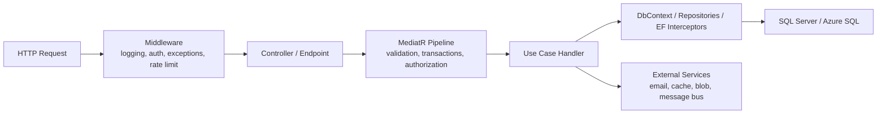

# Cross-Cutting Concerns Guide

Этот документ - практический справочник по cross-cutting concerns для проекта CardLearning.

Его задача: помочь понять не только список сквозных concerns, но и **где они живут**, **зачем они нужны**, **каким механизмом реализуются** и **как их лучше внедрять в нашем ASP.NET Core проекте**.

Документ написан в логике:

1. Что такое cross-cutting concern.
2. Где такие concerns обычно располагаются.
3. Основной список enterprise concerns.
4. Как каждый concern может быть реализован в CardLearning.
5. Что брать в проект сразу, а что отложить.

## 1. Что такое cross-cutting concern

Cross-cutting concern - это поведение, которое нужно многим use cases и многим частям системы, но само по себе не является core business logic одной конкретной фичи.

Примеры:

- logging
- validation
- error handling
- authentication
- authorization
- transactions
- caching
- tracing
- rate limiting

Если use case `CreateDeck` и use case `StartLearningSession` оба нуждаются в логировании, валидации, обработке ошибок и авторизации, то эти механизмы не стоит дублировать в каждом handler или controller.

Именно поэтому такие concerns обычно реализуют **один раз** и встраивают в pipeline.

## 2. Где живут cross-cutting concerns

Главная идея: cross-cutting concerns - это не отдельный слой, в который складывают все подряд.

Они живут в разных местах в зависимости от типа задачи.

### 2.1 HTTP-level concerns

Обычно живут в:

- ASP.NET Core middleware
- filters
- endpoint filters

Примеры:

- request logging
- global exception handling
- authentication
- rate limiting
- CORS
- correlation id

### 2.2 Application-level concerns

Обычно живут в:

- MediatR pipeline behaviors
- decorators
- application services

Примеры:

- validation
- transaction boundary
- authorization checks на уровне use case
- performance timing для handler
- idempotency для command

### 2.3 Persistence-level concerns

Обычно живут в:

- EF Core DbContext
- EF Core interceptors
- database transactions
- query filters

Примеры:

- auditing
- soft delete
- optimistic concurrency
- tenant filtering
- transaction handling

### 2.4 Integration-level concerns

Обычно живут в:

- Infrastructure adapters
- HTTP clients
- background workers
- message consumers/producers

Примеры:

- retry
- timeout
- circuit breaker
- external API logging
- outbox/inbox

## 3. Mental model



## 4. Основной список cross-cutting concerns

Ниже - practical list того, что чаще всего встречается в production и enterprise backend-системах.

### 4.1 Logging

Что решает:

- Позволяет понять, что происходит в системе.
- Помогает искать ошибки, долгие запросы и неожиданные сценарии.
- Дает техническую наблюдаемость без дебага в production.

Как обычно реализуется:

- `ILogger<T>`
- structured logging
- request/response logging middleware
- логирование интеграций

Как сделать в CardLearning:

- В `Api` сделать request logging middleware.
- Логировать путь, HTTP method, status code, duration, trace id.
- В handlers логировать только meaningful business events, а не каждый шаг подряд.
- Использовать structured logs, а не строковую конкатенацию.

Пример:

```csharp
logger.LogInformation(
    "Deck {DeckId} created by user {UserId}",
    deck.Id,
    userId);
```

Где живет:

- `Api` middleware
- `Application` handlers при необходимости
- `Infrastructure` adapters для внешних интеграций

### 4.2 Error Handling

Что решает:

- Делает единый формат ошибок.
- Не дает исключениям хаотично течь в HTTP response.
- Упрощает сопровождение API-контрактов.

Как обычно реализуется:

- global exception middleware
- `ProblemDetails`
- custom domain/application exceptions

Как сделать в CardLearning:

- В `Api` добавить `ExceptionHandlingMiddleware`.
- Возвращать `ProblemDetails` для неожиданных ошибок.
- Для бизнес-сценариев использовать controlled exceptions или result pattern.
- Не размазывать `try/catch` по controllers и handlers без реальной причины.

Где живет:

- `Api`

### 4.3 Validation

Что решает:

- Проверяет входные команды и запросы.
- Не допускает некорректных данных в business logic.
- Убирает дублирование проверок из handlers/controllers.

Как обычно реализуется:

- `FluentValidation`
- MediatR `ValidationBehavior`
- ASP.NET model binding validation

Как сделать в CardLearning:

- Использовать `FluentValidation` для command/query objects.
- Подключить `ValidationBehavior<TRequest, TResponse>` в `Application`.
- Простую syntactic validation держать в validators.
- Domain rules не путать с input validation.

Пример:

- `CreateDeckCommandValidator` проверяет, что `Name` не пустой и не слишком длинный.
- Но правило "пользователь не может создать второй deck с тем же именем" уже ближе к application/business rule.

Где живет:

- в основном `Application`
- частично `Api` для basic request format concerns

### 4.4 Authentication

Что решает:

- Отвечает на вопрос: кто этот пользователь.

Как обычно реализуется:

- OpenID Connect
- JWT Bearer
- cookie auth
- external identity provider

Как сделать в CardLearning:

- На следующем шаге после архитектурного скелета добавить OpenID Connect / JWT Bearer.
- В `Api` подключить authentication middleware.
- Считать identity внешней responsibility, а не хранить пароли вручную в текущем домене.
- В `Application` использовать abstraction вроде `ICurrentUserService`, если use case должен знать текущего пользователя.

Где живет:

- `Api` middleware
- `Application` через `ICurrentUserService`
- `Infrastructure` если нужна concrete integration с identity provider

### 4.5 Authorization

Что решает:

- Отвечает на вопрос: что пользователь имеет право делать.

Как обычно реализуется:

- ASP.NET Core policies
- resource-based authorization
- explicit authorization checks в application handlers

Как сделать в CardLearning:

- Для входа в систему использовать middleware/policies.
- Для бизнес-правил вроде "редактировать deck может только владелец" проверку делать в `Application`.
- Если появятся роли `admin`, `author`, `learner`, часть правил можно вынести в policies.

Пример:

- `UpdateDeckCommandHandler` проверяет, что `Deck.OwnerId == currentUserId`.

Где живет:

- `Api` policies для coarse-grained access
- `Application` handlers для business authorization

### 4.6 Configuration and Options

Что решает:

- Хранит настройки приложения отдельно от кода.
- Позволяет менять окружение: local, test, production.

Как обычно реализуется:

- `appsettings.json`
- `appsettings.Development.json`
- environment variables
- user secrets
- `IOptions<T>`

Как сделать в CardLearning:

- Вынести настройки в strongly typed options classes.
- Подключать connection strings, maintenance mode, auth settings, cache settings через configuration.
- Не читать configuration в случайных местах напрямую без необходимости.

Где живет:

- `Api` и `Infrastructure`

### 4.7 Transactions

Что решает:

- Гарантирует атомарность изменений.
- Помогает избежать частично выполненных business operations.

Как обычно реализуется:

- `DbContext.SaveChangesAsync()`
- явные EF Core transactions
- pipeline behavior вокруг command handlers

Как сделать в CardLearning:

- На старте можно опираться на один `DbContext` и единый `SaveChangesAsync`.
- Когда commands станут более сложными, добавить `TransactionBehavior` для команд.
- Не оборачивать каждый query в transaction.

Где живет:

- `Application` behavior
- `Infrastructure` через EF Core

### 4.8 Caching

Что решает:

- Снижает latency.
- Уменьшает нагрузку на базу и внешние сервисы.

Как обычно реализуется:

- `IMemoryCache`
- Redis
- output caching
- query result caching

Как сделать в CardLearning:

- Пока не добавлять caching в скелет.
- Позже можно кэшировать public decks, deck metadata, maybe statistics.
- Сначала использовать abstraction вроде `ICacheService` только если появляется реальная потребность.
- Для простого старта можно использовать `IMemoryCache`.

Где живет:

- `Api` для output caching
- `Infrastructure` для cache implementation
- `Application` через абстракцию при необходимости

### 4.9 Metrics

Что решает:

- Показывает систему численно: скорость, количество ошибок, нагрузку.

Как обычно реализуется:

- OpenTelemetry Metrics
- Prometheus-compatible metrics
- custom counters/histograms

Как сделать в CardLearning:

- Позже подключить request duration, error count, deck creation count, session completion count.
- На раннем этапе можно отложить, если проект еще учебный и локальный.

Где живет:

- чаще всего `Api` и host-level observability wiring
- частично `Application` и `Infrastructure`

### 4.10 Tracing

Что решает:

- Позволяет видеть путь запроса через систему.
- Особенно полезно при интеграциях и распределенных системах.

Как обычно реализуется:

- OpenTelemetry Tracing
- trace id / span id
- correlation id propagation

Как сделать в CardLearning:

- Сначала достаточно correlation id + structured logging.
- Если появятся external services, then add tracing.

Где живет:

- host-level wiring
- `Api`
- `Infrastructure` integrations

### 4.11 Auditing

Что решает:

- Хранит, кто и когда создал/изменил запись.
- Полезно для безопасности, отладки и админских функций.

Как обычно реализуется:

- base auditable entity
- EF Core interceptor
- overriding `SaveChanges`

Как сделать в CardLearning:

- После добавления auth завести поля `CreatedAtUtc`, `UpdatedAtUtc`, maybe `CreatedByUserId`.
- Реализовать заполнение через EF interceptor или `SaveChanges` hook.
- Не размазывать ручное присваивание этих полей по handlers.

Где живет:

- `Infrastructure`

### 4.12 Security

Что решает:

- Снижает риск уязвимостей и неправильной конфигурации.

Что сюда входит:

- HTTPS
- secret management
- secure headers
- CORS
- input sanitization where needed
- защита от excessive data exposure

Как сделать в CardLearning:

- Использовать HTTPS redirection.
- Не хранить secrets в git.
- Ограничить CORS осознанно, когда появится frontend.
- Не возвращать лишние internal fields наружу.
- Пароли вручную не хранить, если auth уходит во внешний identity provider.

Где живет:

- в основном `Api`
- частично `Infrastructure`

### 4.13 Rate Limiting

Что решает:

- Защищает API от abuse и резких всплесков нагрузки.

Как обычно реализуется:

- ASP.NET Core rate limiting middleware
- per-user / per-IP limits

Как сделать в CardLearning:

- Для публичного API позже можно ограничить анонимные запросы к public endpoints.
- Для login/auth endpoints лимиты особенно полезны.

Где живет:

- `Api`

### 4.14 Resilience

Что решает:

- Устойчивость к сбоям внешних сервисов и сети.

Как обычно реализуется:

- retry
- timeout
- circuit breaker
- fallback
- bulkhead

Как сделать в CardLearning:

- Пока можно отложить, если внешних интеграций почти нет.
- Если появятся email, blob storage, OpenID provider calls, использовать `HttpClientFactory` + Polly-style policies.

Где живет:

- `Infrastructure`

### 4.15 Background Processing

Что решает:

- Позволяет выполнять работу вне HTTP request.

Примеры:

- пересчет статистики
- очистка данных
- отправка email
- delayed processing

Как обычно реализуется:

- `BackgroundService`
- queue
- Hangfire
- Quartz

Как сделать в CardLearning:

- Сначала не добавлять без реальной задачи.
- Позже можно вынести пересчет learning statistics или уведомления в background worker.

Где живет:

- host-level
- `Infrastructure`

### 4.16 Idempotency

Что решает:

- Защищает от повторного выполнения одной и той же команды.

Примеры:

- пользователь дважды нажал кнопку
- клиент повторил HTTP request после timeout

Как обычно реализуется:

- idempotency key
- request store
- command deduplication

Как сделать в CardLearning:

- Не нужно на первом этапе.
- Может пригодиться позже для commands, которые создают сессии или платные операции, если такие появятся.

Где живет:

- `Api`
- `Application`
- `Infrastructure` для хранения ключей

### 4.17 Feature Flags

Что решает:

- Позволяет включать или выключать функции без деплоя новой логики.

Как обычно реализуется:

- config flags
- `Microsoft.FeatureManagement`
- remote config provider

Как сделать в CardLearning:

- Текущий `MaintenanceMode` уже очень близок к feature/operational toggle.
- Можно использовать typed options и централизованный middleware/filter.
- Позже flags пригодятся для запуска нового алгоритма обучения.

Где живет:

- `Api`
- `Application`
- configuration

### 4.18 Performance Monitoring

Что решает:

- Помогает видеть медленные handlers, queries и endpoints.

Как обычно реализуется:

- timing middleware
- MediatR performance behavior
- EF logging and query profiling

Как сделать в CardLearning:

- Добавить request timing middleware.
- Позже добавить `PerformanceBehavior` для MediatR.
- Отдельно анализировать slow SQL queries.

Где живет:

- `Api`
- `Application`
- `Infrastructure`

### 4.19 Concurrency Control

Что решает:

- Помогает корректно обрабатывать одновременное редактирование данных.

Как обычно реализуется:

- optimistic concurrency token
- row version
- conflict handling

Как сделать в CardLearning:

- Когда появится редактирование deck/card несколькими клиентами, добавить row version.
- Обрабатывать concurrency conflicts как controlled application error.

Где живет:

- `Infrastructure`
- частично `Application`

### 4.20 Multi-Tenancy

Что решает:

- Разделяет данные между организациями или tenant boundaries.

Как обычно реализуется:

- tenant resolver
- tenant-aware DbContext
- global query filters

Как сделать в CardLearning:

- На текущем этапе не нужно.
- Если приложение станет B2B SaaS, concern станет системообразующим.

Где живет:

- `Api`
- `Application`
- `Infrastructure`

## 5. Что брать в CardLearning сразу

Не стоит пытаться внедрить все enterprise concerns в первый день. Это даст слишком много ceremony и мало пользы.

Для текущего этапа стоит внедрить сразу:

1. `Logging`
2. `Error Handling`
3. `Validation`
4. `Configuration and Options`
5. `Transactions`
6. `Authentication` как следующий шаг после скелета
7. `Authorization` в момент появления ownership rules

Хороший первый practical набор:

```text
Api:
- ExceptionHandlingMiddleware
- RequestLoggingMiddleware
- Swagger
- Authentication/Authorization wiring later

Application:
- ValidationBehavior
- TransactionBehavior later
- ICurrentUserService abstraction later

Infrastructure:
- EF Core DbContext
- SQL Server
- Migrations
- Auditing later
```

## 6. Что отложить

Пока можно осознанно отложить:

1. distributed caching
2. tracing
3. metrics
4. rate limiting
5. feature flags beyond maintenance mode
6. background processing
7. idempotency
8. multi-tenancy
9. resilience policies для внешних интеграций, если этих интеграций еще нет

Это не значит, что они не нужны вообще. Это значит, что их лучше внедрять в момент реальной необходимости.

## 7. Mapping для CardLearning

Ниже - удобная карта "concern -> where to implement".

| Concern | Main place | Typical mechanism in CardLearning |
|---|---|---|
| Logging | `Api` | middleware + `ILogger<T>` |
| Error handling | `Api` | exception middleware + `ProblemDetails` |
| Validation | `Application` | `FluentValidation` + MediatR behavior |
| Authentication | `Api` | OIDC/JWT middleware |
| Authorization | `Application` + `Api` | policies + ownership checks in handlers |
| Configuration | `Api` / `Infrastructure` | `IOptions<T>` + appsettings/env vars |
| Transactions | `Application` + `Infrastructure` | behavior + EF Core `SaveChangesAsync` |
| Caching | `Infrastructure` | `IMemoryCache` / Redis |
| Metrics | host / `Api` | OpenTelemetry metrics |
| Tracing | host / `Api` | OpenTelemetry tracing + correlation id |
| Auditing | `Infrastructure` | EF interceptor / `SaveChanges` hook |
| Security | `Api` | HTTPS, CORS, headers, secrets |
| Rate limiting | `Api` | rate limiting middleware |
| Resilience | `Infrastructure` | `HttpClientFactory` + retry/timeout policies |
| Background jobs | `Infrastructure` / host | `BackgroundService`, later Hangfire/Quartz |
| Idempotency | `Api` + `Infrastructure` | idempotency key + request store |
| Performance monitoring | `Api` / `Application` | timing middleware + behavior |
| Concurrency | `Infrastructure` | row version + conflict handling |

## 8. Частые ошибки

### Ошибка 1. Складывать все concerns в Infrastructure

Почему плохо:

- `Infrastructure` превращается в "техническую свалку".
- HTTP concerns и use-case concerns оказываются не на своих местах.

Правильнее:

- HTTP concerns в `Api`
- use-case concerns в `Application`
- persistence/integration concerns в `Infrastructure`

### Ошибка 2. Логировать все подряд

Почему плохо:

- шумные логи бесполезны
- сложно искать реальные события

Правильнее:

- логировать вход/выход запроса
- логировать важные business events
- логировать ошибки и медленные операции

### Ошибка 3. Путать validation и business rules

Пример:

- "Name не пустой" - validation
- "Пользователь не может создать второй deck с тем же именем" - application/business rule

### Ошибка 4. Писать authorization только в controller

Почему плохо:

- use case может быть вызван не только из HTTP endpoint
- правила доступа становятся неявными

Правильнее:

- coarse-grained access в `Api`
- business authorization в `Application`

### Ошибка 5. Делать enterprise-сложность слишком рано

Почему плохо:

- много boilerplate
- мало учебной отдачи
- сложно отличить полезную архитектуру от декоративной

Правильнее:

- добавлять concern, когда есть реальный use case или близкая необходимость

## 9. Мини-чеклист для внедрения concerns

Перед добавлением нового cross-cutting concern проверь:

1. Это действительно повторяющаяся сквозная проблема?
2. Это concern HTTP, Application, Persistence или Integration уровня?
3. Его лучше сделать middleware, behavior, interceptor или adapter?
4. Он нужен уже сейчас или пока это архитектурная фантазия на будущее?
5. Как мы протестируем его отдельно от business logic?

## 10. Что делать дальше в проекте

После архитектурного скелета для CardLearning логичный порядок такой:

1. `Logging`
2. `Error Handling`
3. `Validation`
4. `Authentication`
5. `Authorization`
6. `Auditing`
7. `PerformanceBehavior`
8. `Caching` при появлении read-heavy сценариев

Такой порядок даст максимальную пользу без лишней ранней сложности.
