# Подходы к архитектуре .NET / ASP.NET Core проектов

Цель этого документа - дать карту архитектурных подходов, которые можно использовать при создании backend-проектов на .NET, и показать trade-off'ы каждого подхода.

Фокус не в том, чтобы выбрать "самую правильную" архитектуру. Хорошая архитектура - это компромисс между скоростью разработки, сложностью предметной области, размером команды, требованиями к deploy, observability и операционной надежностью.

Документ написан как учебный справочник для CardLearning: сначала mental model, потом диаграммы, потом trade-off'ы, потом cross-cutting concerns.

## Быстрый вывод

Для CardLearning на текущем этапе я бы не начинал с microservices. Самый здоровый путь:

1. Начать с **single deployment monolith**.
2. Организовать код как **Clean Architecture + Vertical Slices**.
3. Держать `Domain` и `Application` независимыми от ASP.NET Core и EF Core.
4. Cross-cutting concerns внедрять через middleware, filters, MediatR/endpoint pipeline behaviors, EF Core interceptors и decorators.
5. Если появятся явные bounded contexts, вырастить это в **Modular Monolith**.
6. Microservices рассматривать только когда появится реальная потребность в independent deploy, independent scaling или ownership by different teams.

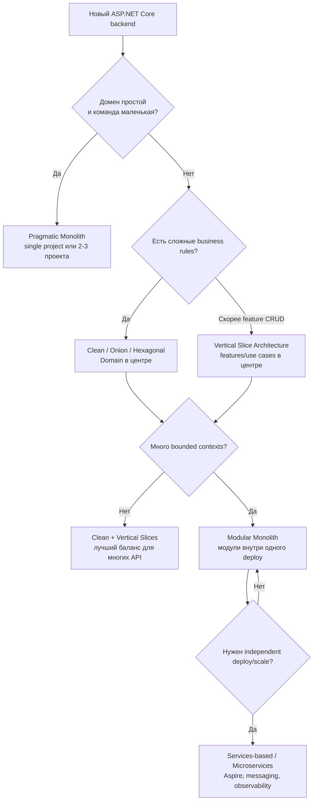
```mermaid
flowchart TD
    Start["Новый ASP.NET Core backend"] --> Simple{"Домен простой\nи команда маленькая?"}
    Simple -->|Да| Pragmatic["Pragmatic Monolith\nsingle project или 2-3 проекта"]
    Simple -->|Нет| Domain{"Есть сложные business rules?"}
    Domain -->|Да| Clean["Clean / Onion / Hexagonal\nDomain в центре"]
    Domain -->|Скорее feature CRUD| VSA["Vertical Slice Architecture\nfeatures/use cases в центре"]
    Clean --> Growth{"Много bounded contexts?"}
    VSA --> Growth
    Growth -->|Нет| Hybrid["Clean + Vertical Slices\nлучший баланс для многих API"]
    Growth -->|Да| Modulith["Modular Monolith\nмодули внутри одного deploy"]
    Modulith --> Scale{"Нужен independent deploy/scale?"}
    Scale -->|Нет| Modulith
    Scale -->|Да| Microservices["Services-based / Microservices\nAspire, messaging, observability"]
```

## Три оси выбора

Архитектуру полезно выбирать не по названию, а по трем осям.

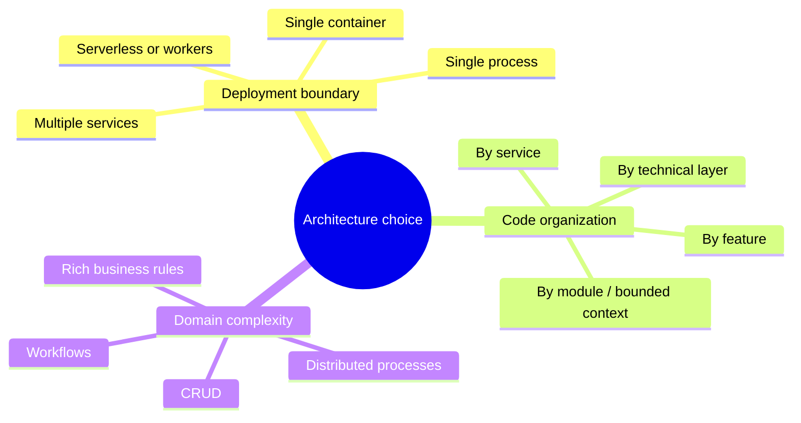
```mermaid
mindmap
  root((Architecture choice))
    Deployment boundary
      Single process
      Single container
      Multiple services
      Serverless or workers
    Code organization
      By technical layer
      By feature
      By module / bounded context
      By service
    Domain complexity
      CRUD
      Workflows
      Rich business rules
      Distributed processes
```

Главная мысль: **Clean Architecture, Vertical Slice, Modular Monolith и Microservices отвечают на разные вопросы**.

Clean Architecture отвечает: "куда должны смотреть зависимости?"

Vertical Slice отвечает: "как группировать код вокруг use cases?"

Modular Monolith отвечает: "как разделить большой домен на модули без distributed system pain?"

Microservices отвечают: "как разнести deploy/runtime ownership между независимыми сервисами?"

## Карта подходов

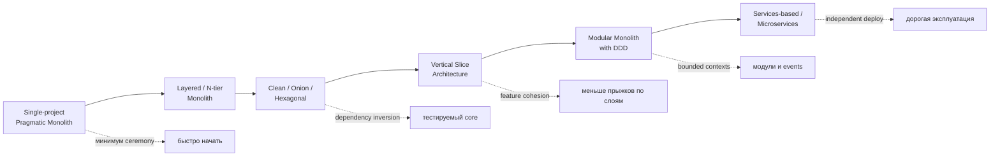
```mermaid
flowchart LR
    A["Single-project\nPragmatic Monolith"] --> B["Layered / N-tier\nMonolith"]
    B --> C["Clean / Onion /\nHexagonal"]
    C --> D["Vertical Slice\nArchitecture"]
    D --> E["Modular Monolith\nwith DDD"]
    E --> F["Services-based /\nMicroservices"]

    A -. "минимум ceremony" .-> A1["быстро начать"]
    C -. "dependency inversion" .-> C1["тестируемый core"]
    D -. "feature cohesion" .-> D1["меньше прыжков по слоям"]
    E -. "bounded contexts" .-> E1["модули и events"]
    F -. "independent deploy" .-> F1["дорогая эксплуатация"]
```

## 1. Pragmatic Monolith / Single Project

Это самый простой вариант: один ASP.NET Core проект, внутри folders для endpoints/controllers, services, data access, models.

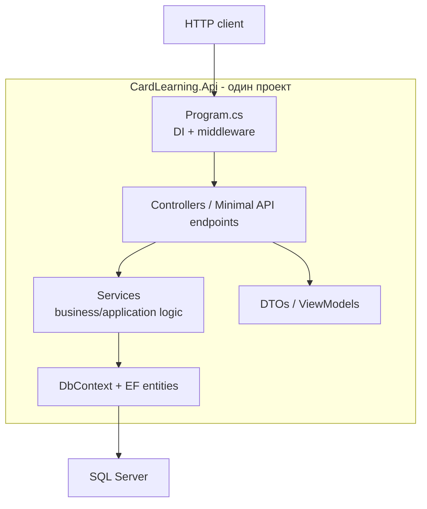
```mermaid
flowchart TD
    subgraph WebProject["CardLearning.Api - один проект"]
        Program["Program.cs\nDI + middleware"]
        Controllers["Controllers / Minimal API endpoints"]
        Services["Services\nbusiness/application logic"]
        Data["DbContext + EF entities"]
        Models["DTOs / ViewModels"]
    end

    Client["HTTP client"] --> Program --> Controllers --> Services --> Data --> Db["SQL Server"]
    Controllers --> Models
```

### Когда подходит

1. MVP.
2. Учебный проект.
3. Небольшой internal tool.
4. Домен в основном CRUD.
5. Один-два разработчика.
6. Важна скорость, а не долгосрочная архитектурная строгость.

### Trade-off'ы

Плюсы:

1. Самый низкий cognitive load.
2. Быстро создать и запустить.
3. Меньше проектов, меньше DI ceremony.
4. Легко дебажить.

Минусы:

1. Business logic быстро расползается по controllers/services.
2. Сложнее держать dependency rules.
3. Тесты часто превращаются в integration tests через real infrastructure.
4. Чем проект больше, тем выше риск "папочного spaghetti".

### Где живут cross-cutting concerns

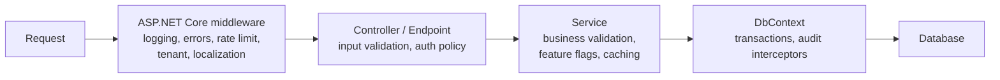
```mermaid
flowchart LR
    Request["Request"] --> MW["ASP.NET Core middleware\nlogging, errors, rate limit,\ntenant, localization"]
    MW --> Endpoint["Controller / Endpoint\ninput validation, auth policy"]
    Endpoint --> Service["Service\nbusiness validation,\nfeature flags, caching"]
    Service --> DbContext["DbContext\ntransactions, audit interceptors"]
    DbContext --> Db["Database"]
```

В этом подходе concerns часто живут прямо в `Program.cs`, middleware и service classes. Это нормально на старте, но важно не дать `Program.cs` превратиться в "архитектурный чердак".

### Примеры

1. Официальный `dotnet new webapi` / Minimal API templates.
2. Microsoft docs про all-in-one monolith: [Common web application architectures](https://learn.microsoft.com/en-us/dotnet/architecture/modern-web-apps-azure/common-web-application-architectures).

## 2. Layered / N-tier Monolith

Классический подход: UI/API layer -> Business/Application layer -> Data Access layer.

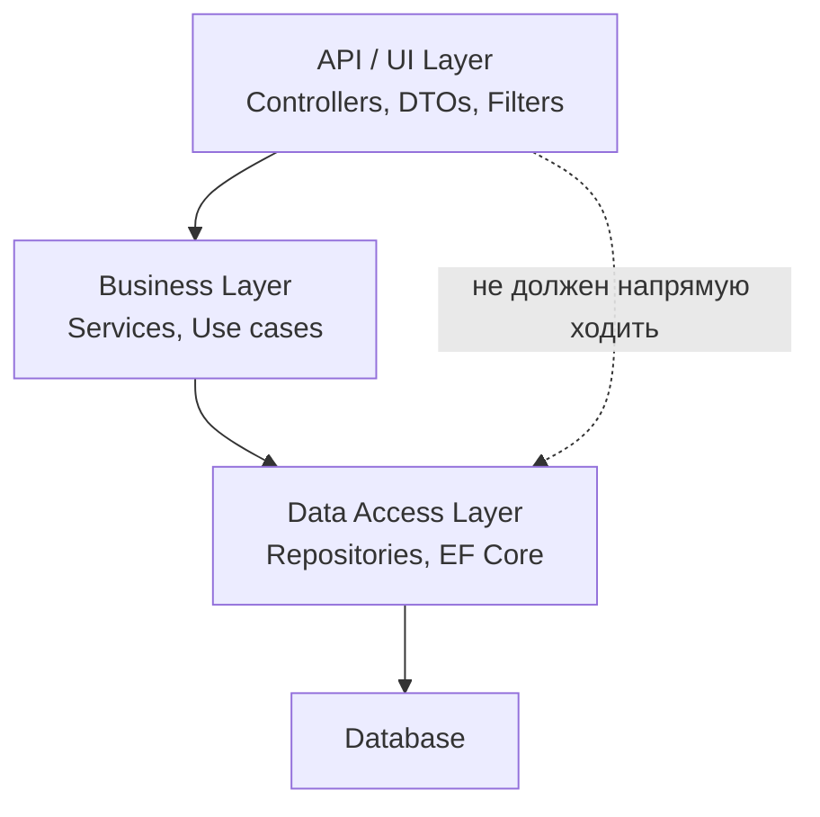
```mermaid
flowchart TD
    Api["API / UI Layer\nControllers, DTOs, Filters"] --> Business["Business Layer\nServices, Use cases"]
    Business --> Data["Data Access Layer\nRepositories, EF Core"]
    Data --> Db["Database"]

    Api -. "не должен напрямую ходить" .-> Data
```

### Ментальная модель

Это как офис с этажами: запрос приходит на ресепшен, потом идет в бизнес-отдел, потом в архив/базу данных. Каждый этаж знает только этаж ниже.

### Когда подходит

1. CRUD-heavy enterprise apps.
2. Команда привыкла к разделению UI/BLL/DAL.
3. Нужна простая логическая структура без строгого DDD.
4. Проект должен быть понятен разработчикам с classic enterprise background.

### Trade-off'ы

Плюсы:

1. Понятная структура.
2. Хорошее separation of concerns на базовом уровне.
3. Легко объяснить новым людям.
4. Подходит для большинства простых business apps.

Минусы:

1. Зависимости обычно смотрят сверху вниз, и business layer зависит от DAL.
2. Feature changes заставляют прыгать по нескольким проектам и папкам.
3. Растет риск "анемичной" модели: DTO -> Service -> Repository -> DbContext.
4. Cross-cutting concerns часто реализуются ad hoc в service base classes или filters.

### Где живут cross-cutting concerns

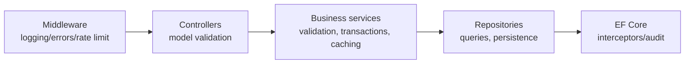
```mermaid
flowchart LR
    Middleware["Middleware\nlogging/errors/rate limit"] --> Controllers["Controllers\nmodel validation"]
    Controllers --> AppServices["Business services\nvalidation, transactions, caching"]
    AppServices --> Repositories["Repositories\nqueries, persistence"]
    Repositories --> Ef["EF Core\ninterceptors/audit"]
```

В Layered architecture важно не класть все concerns в Business Service. Лучше использовать pipeline/decorator подходы даже без Clean Architecture.

### Примеры

1. Microsoft docs: [Traditional N-Layer architecture applications](https://learn.microsoft.com/en-us/dotnet/architecture/modern-web-apps-azure/common-web-application-architectures#traditional-n-layer-architecture-applications).
2. [NimblePros/eShopOnWeb](https://github.com/NimblePros/eShopOnWeb) - монолитный reference app с single deployment и архитектурными принципами modern web apps.

## 3. Clean / Onion / Hexagonal Architecture

Clean Architecture ставит business model и application rules в центр. Внешние детали зависят от core, а не наоборот.

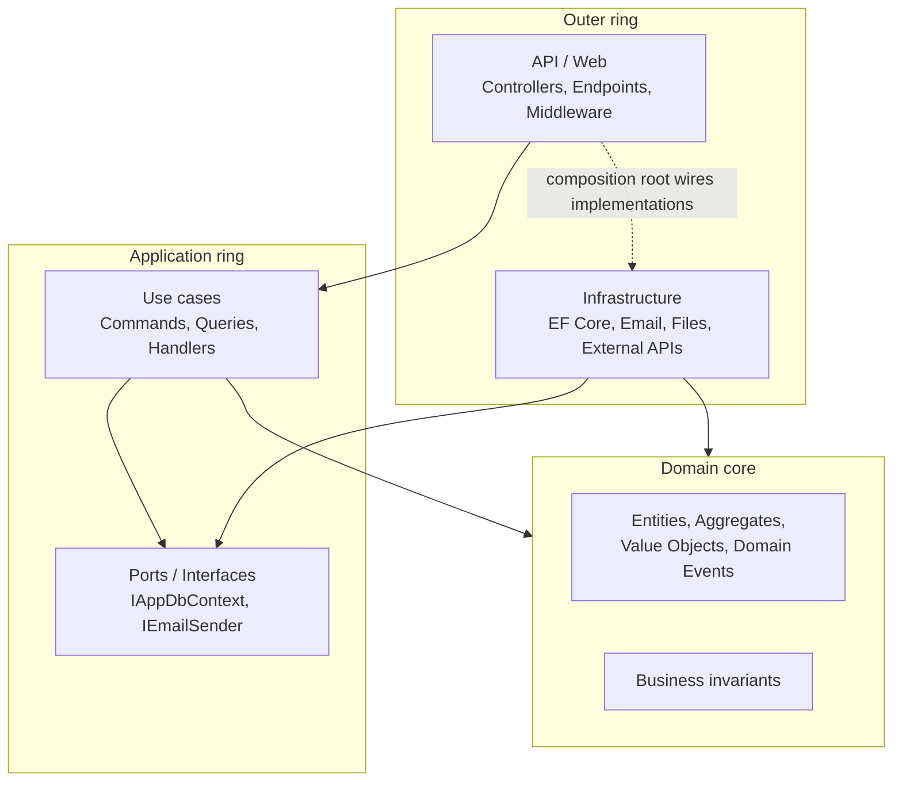
```mermaid
flowchart TD
    subgraph Outer["Outer ring"]
        Api["API / Web\nControllers, Endpoints, Middleware"]
        Infra["Infrastructure\nEF Core, Email, Files, External APIs"]
    end

    subgraph App["Application ring"]
        UseCases["Use cases\nCommands, Queries, Handlers"]
        Ports["Ports / Interfaces\nIAppDbContext, IEmailSender"]
    end

    subgraph Domain["Domain core"]
        Entities["Entities, Aggregates,\nValue Objects, Domain Events"]
        Rules["Business invariants"]
    end

    Api --> UseCases
    UseCases --> Domain
    UseCases --> Ports
    Infra --> Ports
    Infra --> Domain
    Api -. "composition root wires implementations" .-> Infra
```

### Главное правило зависимостей

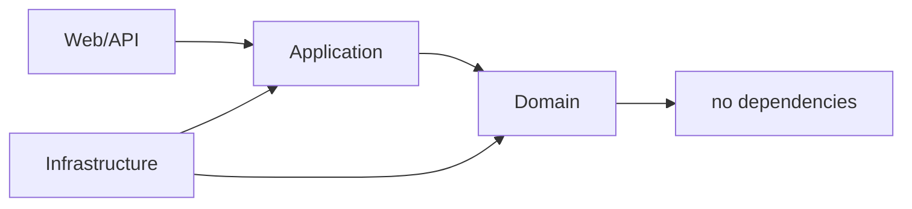
```mermaid
flowchart LR
    Web["Web/API"] --> Application["Application"]
    Infrastructure["Infrastructure"] --> Application
    Application --> Domain["Domain"]
    Infrastructure --> Domain
    Domain --> Nothing["no dependencies"]
```

Внутренние слои не знают о внешних. `Domain` не знает про ASP.NET Core, EF Core, MediatR, SQL Server, Redis, Azure.

### Когда подходит

1. Домен не просто CRUD.
2. Нужна хорошая тестируемость business logic.
3. Есть шанс менять infrastructure: DB, message broker, external providers.
4. Проект будет жить долго.
5. Команда готова платить за архитектурную дисциплину.

### Trade-off'ы

Плюсы:

1. Хорошая testability.
2. Ясные dependency rules.
3. Infrastructure можно заменить без переписывания core.
4. Business rules не тонут в controllers и EF.
5. Удобно добавлять cross-cutting concerns через application pipeline behaviors.

Минусы:

1. Больше проектов и abstractions.
2. На простом CRUD может ощущаться как overengineering.
3. Легко создать "ritual architecture": много interfaces без реальной пользы.
4. Не решает сама по себе feature cohesion: код одного use case может быть размазан по слоям.

### Где живут cross-cutting concerns

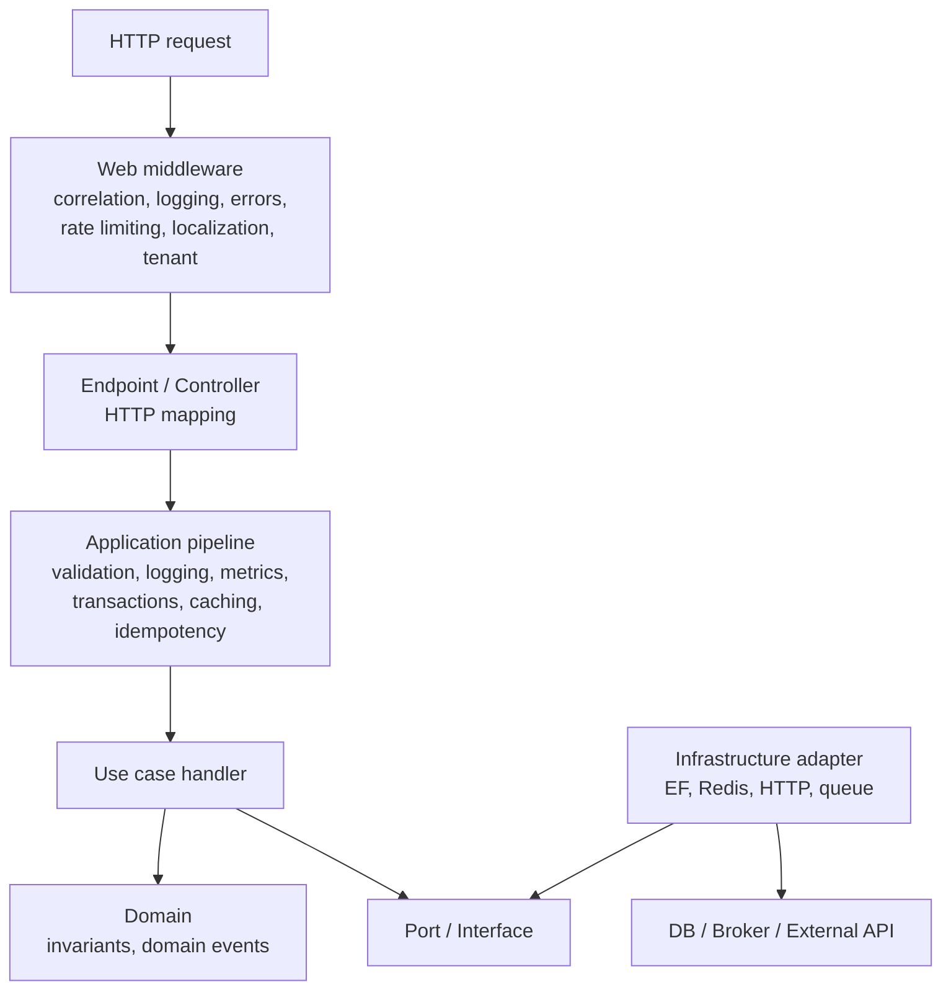
```mermaid
flowchart TD
    Request["HTTP request"] --> Middleware["Web middleware\ncorrelation, logging, errors,\nrate limiting, localization, tenant"]
    Middleware --> Endpoint["Endpoint / Controller\nHTTP mapping"]
    Endpoint --> Pipeline["Application pipeline\nvalidation, logging, metrics,\ntransactions, caching, idempotency"]
    Pipeline --> Handler["Use case handler"]
    Handler --> Domain["Domain\ninvariants, domain events"]
    Handler --> Port["Port / Interface"]
    Infra["Infrastructure adapter\nEF, Redis, HTTP, queue"] --> Port
    Infra --> External["DB / Broker / External API"]
```

Clean Architecture хорошо принимает concerns через:

1. ASP.NET Core middleware для HTTP concerns.
2. MediatR behaviors / endpoint filters / decorators для use-case concerns.
3. EF Core interceptors для persistence concerns.
4. Infrastructure adapters для retry, timeout, caching, external APIs.

### Примеры

1. [ardalis/CleanArchitecture](https://github.com/ardalis/CleanArchitecture) - известный template; README отдельно сравнивает full Clean Architecture и minimal vertical slice вариант.
2. [NimblePros/eShopOnWeb](https://github.com/NimblePros/eShopOnWeb) - reference monolith для modern ASP.NET Core web apps.
3. Microsoft docs: [Clean architecture section](https://learn.microsoft.com/en-us/dotnet/architecture/modern-web-apps-azure/common-web-application-architectures#clean-architecture).

## 4. Vertical Slice Architecture

Vertical Slice Architecture группирует код не по техническим слоям, а по feature/use case.

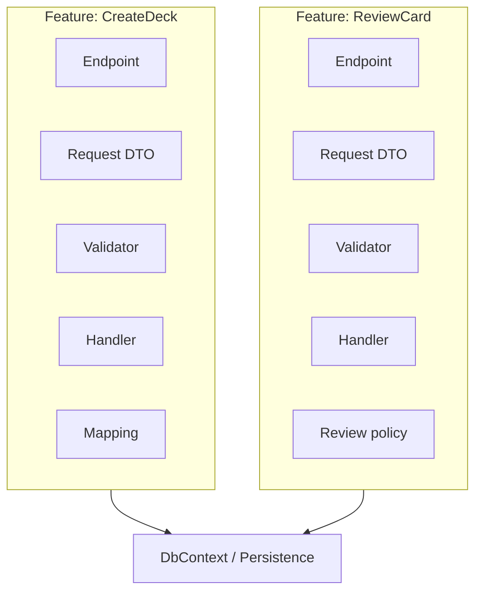
```mermaid
flowchart TD
    subgraph FeatureA["Feature: CreateDeck"]
        AEndpoint["Endpoint"]
        ARequest["Request DTO"]
        AValidator["Validator"]
        AHandler["Handler"]
        AMapping["Mapping"]
    end

    subgraph FeatureB["Feature: ReviewCard"]
        BEndpoint["Endpoint"]
        BRequest["Request DTO"]
        BValidator["Validator"]
        BHandler["Handler"]
        BPolicy["Review policy"]
    end

    FeatureA --> Db["DbContext / Persistence"]
    FeatureB --> Db
```

### Сравнение с layered

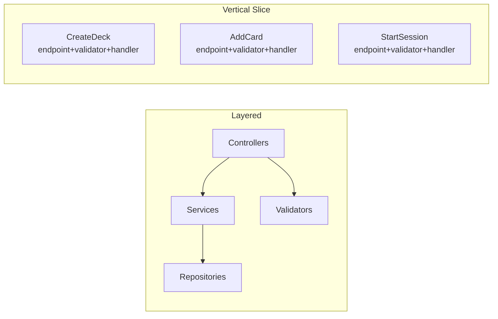
```mermaid
flowchart LR
    subgraph Layered["Layered"]
        LC["Controllers"]
        LS["Services"]
        LR["Repositories"]
        LV["Validators"]
        LC --> LS --> LR
        LC --> LV
    end

    subgraph Vertical["Vertical Slice"]
        F1["CreateDeck\nendpoint+validator+handler"]
        F2["AddCard\nendpoint+validator+handler"]
        F3["StartSession\nendpoint+validator+handler"]
    end
```

### Ментальная модель

В layered architecture ты режешь торт горизонтально на коржи. В vertical slice ты режешь торт кусками, чтобы в каждом куске были все слои, нужные для конкретного use case.

### Когда подходит

1. API с большим количеством independent use cases.
2. Частые feature changes.
3. Команда хочет уменьшить coupling между unrelated features.
4. Use cases важнее технических слоев.
5. CQRS/MediatR/FastEndpoints хорошо ложатся на стиль команды.

### Trade-off'ы

Плюсы:

1. Изменение feature обычно локализовано в одной папке.
2. Меньше shared service classes, которые становятся god objects.
3. Хорошо сочетается с CQRS.
4. Удобно добавлять validation/caching/idempotency per use case.

Минусы:

1. Есть риск duplication между slices.
2. Нужна дисциплина, чтобы не создавать хаос из feature folders.
3. Shared domain logic все равно нужно выносить аккуратно.
4. Для junior-разработчиков сначала может быть менее привычно, чем layers.

### Где живут cross-cutting concerns

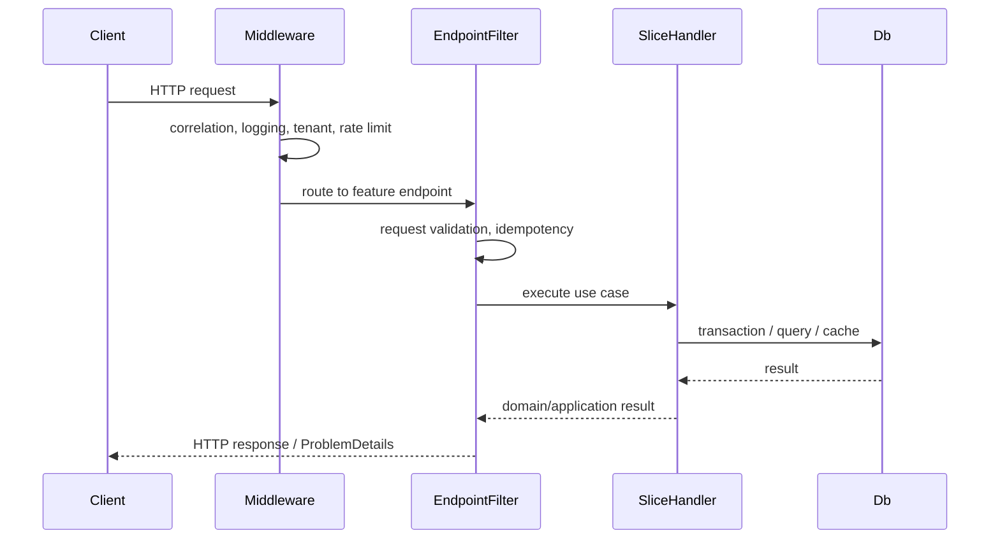
```mermaid
sequenceDiagram
    participant Client
    participant Middleware
    participant EndpointFilter
    participant SliceHandler
    participant Db

    Client->>Middleware: HTTP request
    Middleware->>Middleware: correlation, logging, tenant, rate limit
    Middleware->>EndpointFilter: route to feature endpoint
    EndpointFilter->>EndpointFilter: request validation, idempotency
    EndpointFilter->>SliceHandler: execute use case
    SliceHandler->>Db: transaction / query / cache
    Db-->>SliceHandler: result
    SliceHandler-->>EndpointFilter: domain/application result
    EndpointFilter-->>Client: HTTP response / ProblemDetails
```

В Vertical Slice concerns часто удобно делать как:

1. Endpoint filters.
2. MediatR pipeline behaviors.
3. Per-feature validators.
4. Per-feature authorization/rate-limit/cache policies.
5. Shared decorators для `IRequestHandler<TRequest,TResponse>`.

### Примеры

1. [jeangatto/ASP.NET-Core-Vertical-Slice-Architecture](https://github.com/jeangatto/ASP.NET-Core-Vertical-Slice-Architecture) - ASP.NET Core 9, CQRS, MediatR, FluentValidation.
2. [ardalis/CleanArchitecture](https://github.com/ardalis/CleanArchitecture) - в README есть minimal Clean Architecture template с single Web project и vertical slices.

## 5. Modular Monolith

Modular Monolith - это один deployable application, но внутри код разделен на модули, похожие на будущие service boundaries.

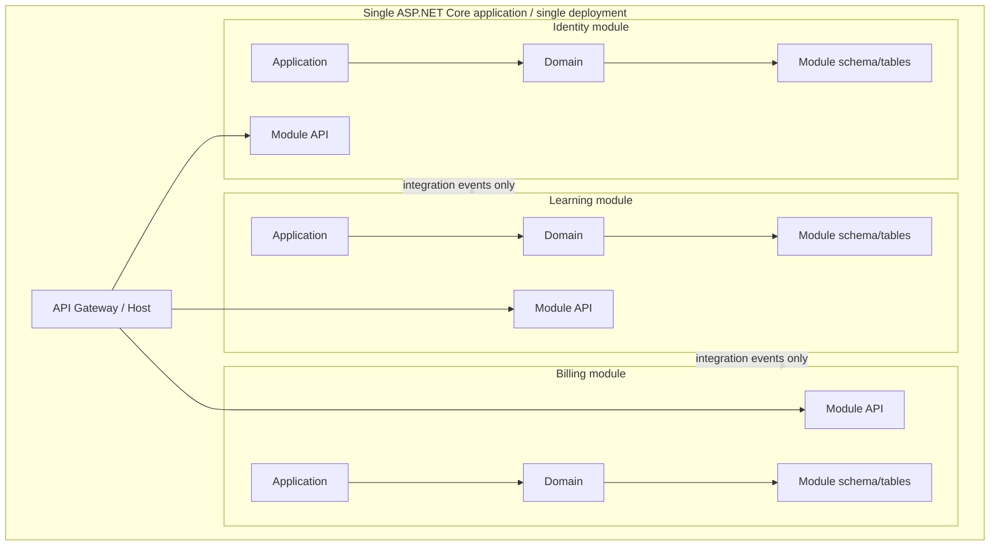
```mermaid
flowchart TD
    subgraph App["Single ASP.NET Core application / single deployment"]
        Api["API Gateway / Host"]

        subgraph Learning["Learning module"]
            LApi["Module API"]
            LApp["Application"]
            LDomain["Domain"]
            LDb["Module schema/tables"]
        end

        subgraph Billing["Billing module"]
            BApi["Module API"]
            BApp["Application"]
            BDomain["Domain"]
            BDb["Module schema/tables"]
        end

        subgraph Identity["Identity module"]
            IApi["Module API"]
            IApp["Application"]
            IDomain["Domain"]
            IDb["Module schema/tables"]
        end
    end

    Api --> LApi
    Api --> BApi
    Api --> IApi
    LApp --> LDomain --> LDb
    BApp --> BDomain --> BDb
    IApp --> IDomain --> IDb
    Learning -. "integration events only" .-> Billing
    Identity -. "integration events only" .-> Learning
```

### Ментальная модель

Это не "маленький монолит". Это скорее жилой дом с отдельными квартирами: один адрес, одна крыша, общая инфраструктура, но у каждой квартиры свои границы и правила.

### Когда подходит

1. Домен большой, но microservices пока рано.
2. Есть bounded contexts.
3. Нужна строгая modularity без distributed transactions.
4. Команды могут работать над разными modules.
5. Есть желание оставить путь к будущему service extraction.

### Trade-off'ы

Плюсы:

1. Один deploy, проще эксплуатация.
2. Четкие domain boundaries.
3. Можно использовать in-process calls, но держать модульные контракты.
4. Хороший stepping stone перед microservices.
5. Проще consistency, чем в distributed system.

Минусы:

1. Нужна дисциплина: модули не должны лезть в таблицы друг друга.
2. Shared kernel может стать свалкой.
3. Нужны architecture tests или conventions.
4. Сложнее стартовать, чем Clean + Vertical Slice.
5. Если boundaries выбраны плохо, modular monolith становится просто большим layered monolith.

### Module communication

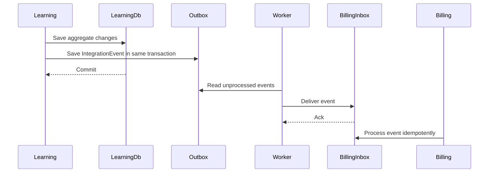
```mermaid
sequenceDiagram
    participant Learning
    participant LearningDb
    participant Outbox
    participant Worker
    participant BillingInbox
    participant Billing

    Learning->>LearningDb: Save aggregate changes
    Learning->>Outbox: Save IntegrationEvent in same transaction
    LearningDb-->>Learning: Commit
    Worker->>Outbox: Read unprocessed events
    Worker->>BillingInbox: Deliver event
    BillingInbox-->>Worker: Ack
    Billing->>BillingInbox: Process event idempotently
```

### Где живут cross-cutting concerns

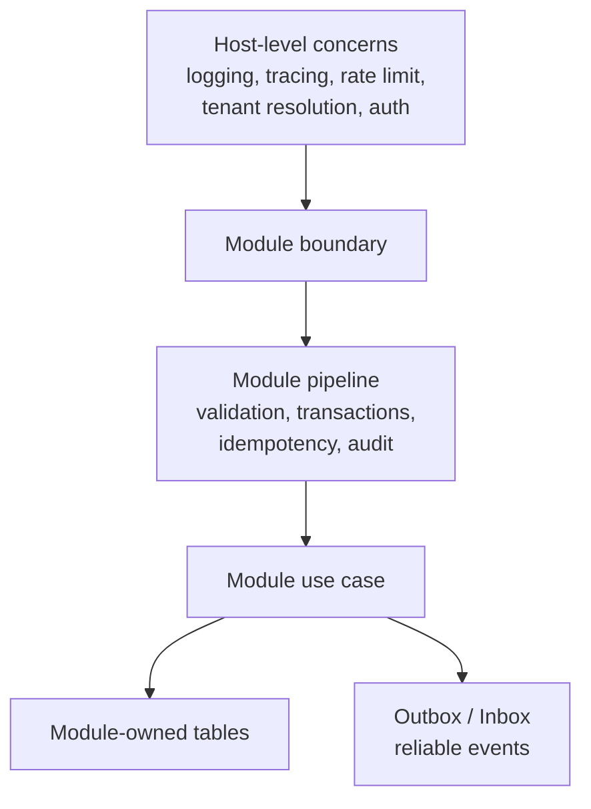
```mermaid
flowchart TD
    Host["Host-level concerns\nlogging, tracing, rate limit,\ntenant resolution, auth"] --> ModuleBoundary["Module boundary"]
    ModuleBoundary --> ModulePipeline["Module pipeline\nvalidation, transactions,\nidempotency, audit"]
    ModulePipeline --> ModuleUseCase["Module use case"]
    ModuleUseCase --> ModuleDb["Module-owned tables"]
    ModuleUseCase --> Outbox["Outbox / Inbox\nreliable events"]
```

В Modular Monolith concerns делятся на:

1. Host-level: HTTP, auth, tenant, rate limiting, correlation.
2. Module-level: validation, transactions, audit, feature flags, localization resources.
3. Integration-level: outbox/inbox, idempotency, retries, event versioning.

### Примеры

1. [kgrzybek/modular-monolith-with-ddd](https://github.com/kgrzybek/modular-monolith-with-ddd) - один из лучших .NET примеров Modular Monolith + DDD + Outbox/Inbox.
2. [baranacikgoz/modular-monolith-ddd-vsa-webapi](https://github.com/baranacikgoz/modular-monolith-ddd-vsa-webapi) - более тяжелый boilerplate с Modular Monolith, DDD, Vertical Slices, Hangfire, MassTransit, OpenTelemetry, Redis, localization.

## 6. CQRS / Event-Driven внутри монолита

CQRS - это не отдельная архитектура всего приложения. Это способ разделить commands и queries. Event-driven подход добавляет domain events/integration events.

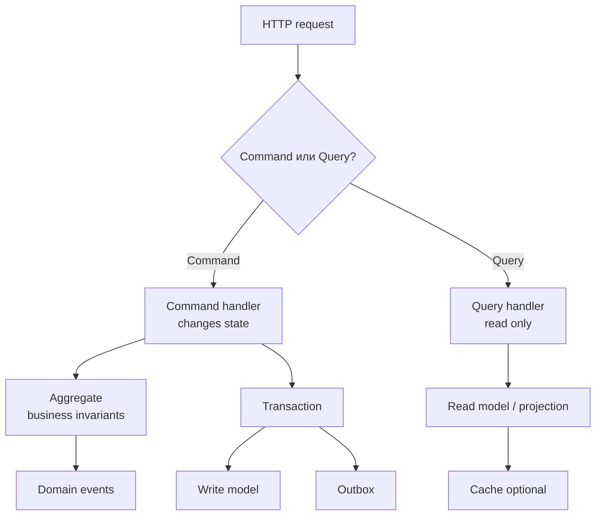
```mermaid
flowchart TD
    Request["HTTP request"] --> CommandOrQuery{"Command или Query?"}
    CommandOrQuery -->|Command| CommandHandler["Command handler\nchanges state"]
    CommandHandler --> Aggregate["Aggregate\nbusiness invariants"]
    Aggregate --> DomainEvents["Domain events"]
    CommandHandler --> Tx["Transaction"]
    Tx --> Db["Write model"]
    Tx --> Outbox["Outbox"]

    CommandOrQuery -->|Query| QueryHandler["Query handler\nread only"]
    QueryHandler --> ReadModel["Read model / projection"]
    ReadModel --> Cache["Cache optional"]
```

### Когда подходит

1. Commands и queries имеют разную сложность.
2. Read models отличаются от write models.
3. Есть workflow side effects.
4. Нужны domain events.
5. Нужно reliable async processing через outbox.

### Trade-off'ы

Плюсы:

1. Четко видно, что меняет состояние, а что только читает.
2. Queries можно оптимизировать отдельно.
3. Events помогают decouple side effects.
4. Хорошо ложится на Clean + Vertical Slice.

Минусы:

1. Добавляет concepts и ceremony.
2. Eventual consistency сложнее объяснять и тестировать.
3. Есть риск использовать MediatR как "магический автобус" без архитектуры.
4. Не стоит делать full CQRS/Event Sourcing только потому, что это красиво выглядит на диаграмме.

### Где живут cross-cutting concerns

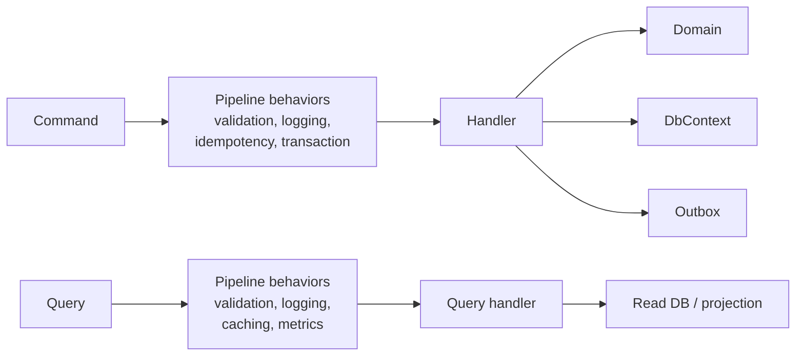
```mermaid
flowchart LR
    Command["Command"] --> Behaviors["Pipeline behaviors\nvalidation, logging,\nidempotency, transaction"]
    Behaviors --> Handler["Handler"]
    Handler --> Domain["Domain"]
    Handler --> Db["DbContext"]
    Handler --> Outbox["Outbox"]

    Query["Query"] --> QueryBehaviors["Pipeline behaviors\nvalidation, logging,\ncaching, metrics"]
    QueryBehaviors --> QueryHandler["Query handler"]
    QueryHandler --> ReadDb["Read DB / projection"]
```

## 7. Services-based / Microservices / .NET Aspire

Microservices - это не просто "много проектов". Это independent deployable services, каждый со своим runtime boundary, data ownership и operational surface.

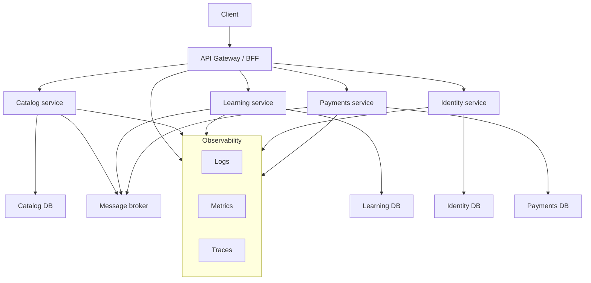
```mermaid
flowchart TD
    Client["Client"] --> Gateway["API Gateway / BFF"]

    Gateway --> Catalog["Catalog service"]
    Gateway --> Learning["Learning service"]
    Gateway --> Identity["Identity service"]
    Gateway --> Payments["Payments service"]

    Catalog --> CatalogDb["Catalog DB"]
    Learning --> LearningDb["Learning DB"]
    Identity --> IdentityDb["Identity DB"]
    Payments --> PaymentsDb["Payments DB"]

    Catalog --> Broker["Message broker"]
    Learning --> Broker
    Payments --> Broker

    subgraph Observability["Observability"]
        Logs["Logs"]
        Metrics["Metrics"]
        Traces["Traces"]
    end

    Gateway --> Observability
    Catalog --> Observability
    Learning --> Observability
    Identity --> Observability
    Payments --> Observability
```

### Когда подходит

1. Разные части системы требуют independent deploy.
2. Разные части системы масштабируются по-разному.
3. Разные команды владеют разными domains.
4. Есть mature DevOps, CI/CD, monitoring, incident response.
5. Цена distributed complexity оправдана бизнесом.

### Trade-off'ы

Плюсы:

1. Independent deploy.
2. Independent scaling.
3. Четкие ownership boundaries.
4. Fault isolation при хорошем дизайне.
5. Можно выбирать storage/technology per service.

Минусы:

1. Distributed transactions почти всегда заменяются sagas/outbox/eventual consistency.
2. Debugging и testing сложнее.
3. Нужны tracing, metrics, logs с первого дня.
4. Network failures становятся частью business logic.
5. Versioning contracts, retries, idempotency, security и deployment становятся дороже.

### Где живут cross-cutting concerns

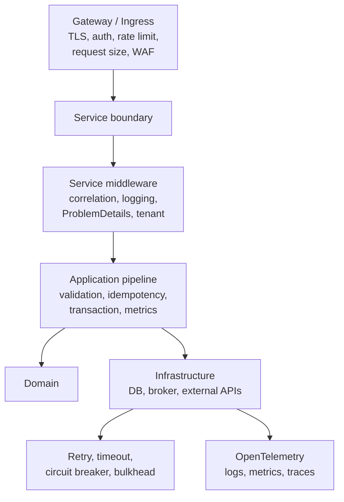
```mermaid
flowchart TD
    Edge["Gateway / Ingress\nTLS, auth, rate limit,\nrequest size, WAF"] --> Service["Service boundary"]
    Service --> Middleware["Service middleware\ncorrelation, logging,\nProblemDetails, tenant"]
    Middleware --> AppPipeline["Application pipeline\nvalidation, idempotency,\ntransaction, metrics"]
    AppPipeline --> Domain["Domain"]
    AppPipeline --> Infra["Infrastructure\nDB, broker, external APIs"]
    Infra --> Resilience["Retry, timeout,\ncircuit breaker, bulkhead"]
    Infra --> Telemetry["OpenTelemetry\nlogs, metrics, traces"]
```

### Примеры

1. [dotnet/eShop](https://github.com/dotnet/eShop) - актуальный Microsoft reference app, services-based architecture на .NET Aspire.
2. Microsoft docs: [.NET Microservices architecture guide](https://learn.microsoft.com/en-us/dotnet/architecture/microservices/architect-microservice-container-applications/).
3. [Azure-Samples/eShopOnAzure](https://github.com/Azure-Samples/eShopOnAzure) - deployment-oriented вариант eShop для Azure.

## Cross-cutting concerns: общая карта

Cross-cutting concern - это поведение, которое нужно многим use cases, но оно не является core business logic одного use case.

```mermaid
flowchart LR
    Request["HTTP request"] --> Edge["Edge\nrate limit, auth,\nrequest logging"]
    Edge --> Middleware["Middleware\nerrors, correlation,\ntenant, localization"]
    Middleware --> Endpoint["Endpoint\nHTTP mapping,\nmodel validation"]
    Endpoint --> AppPipeline["Application pipeline\nvalidation, logging,\nmetrics, transaction,\nidempotency, caching"]
    AppPipeline --> Domain["Domain\ninvariants,\ndomain events"]
    Domain --> Persistence["Persistence\nEF interceptors,\naudit, concurrency"]
    AppPipeline --> Infra["Infrastructure\nresilience, tracing,\nexternal calls"]
    Infra --> External["DB / Broker / APIs"]
```

Главное правило: **не все concerns должны жить в одном месте**.

HTTP concern обычно живет в middleware/filter/endpoint.

Use-case concern обычно живет в application pipeline/decorator.

Persistence concern обычно живет в DbContext/interceptor/Unit of Work.

Integration concern обычно живет в infrastructure adapter, message consumer или gateway.

## Матрица: как подходы реализуют concerns

Легенда:

1. `P` - Program.cs / middleware / filters.
2. `A` - Application pipeline / decorators / endpoint filters.
3. `D` - Domain model / invariants / domain events.
4. `I` - Infrastructure adapters / EF Core / Redis / HTTP clients / broker.
5. `M` - Module boundary / module pipeline.
6. `S` - Service boundary / gateway / service mesh / distributed telemetry.

| Concern | Pragmatic / Layered | Clean Architecture | Vertical Slice | Modular Monolith | Microservices |
|---|---|---|---|---|---|
| Logging | `P` request logging + `ILogger` in services | `P` + `A` logging behavior | `P` + per-slice endpoint/filter logging | Host logging + module labels | Gateway + per-service structured logs + centralized log store |
| Error Handling | Global exception middleware/filter | `P` ProblemDetails + application result mapping | Per-slice result mapping + global ProblemDetails | Host ProblemDetails + module error contracts | Service-specific error contracts, gateway mapping, no leaking internals |
| Validation | Model validation in controllers/services | Request validators in `A`, invariants in `D` | Validator рядом со slice | Module validators + domain invariants | API schema validation + message validation per service |
| Configuration | `appsettings` read in services | Options in `I`, abstractions in `A` | Per-feature options where needed | Per-module options sections | Central config/secrets per service/environment |
| Transactions | Service method starts EF transaction | Transaction behavior around command handlers | Transaction endpoint/MediatR filter per command | Module-local transaction; no cross-module DB transaction | Local transaction only; saga/outbox for cross-service |
| Caching | `IMemoryCache`/`IDistributedCache` in services | Query decorators or infrastructure cache adapters | Per-query/per-slice cache policy | Module-owned cache namespace | Service-owned cache; invalidation via events |
| Metrics | Basic ASP.NET metrics | Use-case metrics behavior | Per-slice metrics tags | Module tags: `module=learning` | Per-service RED/USE metrics; dashboards per service |
| Tracing | Request trace only | Activity around use cases and infra | Slice span names by feature | Module spans + event spans | Distributed tracing mandatory across HTTP/messages |
| Auditing | EF interceptors or service logging | Domain events + EF interceptors | Slice command audit decorators | Module audit log + outbox event audit | Per-service audit stream; immutable event/audit storage |
| Rate Limiting | ASP.NET Core rate limiting middleware | API layer policies; Application usually unaware | Endpoint/group policies per slice | Host/global + module-specific policies | Gateway/ingress primary; service fallback limits |
| Resilience | Polly in service HTTP calls | Resilience in infrastructure adapters | Per-slice external dependency policy | Module integration retries + outbox/inbox | Client retries, circuit breakers, timeouts, bulkheads, service mesh optional |
| Background Jobs | `IHostedService`, Hangfire, Quartz in same project | Workers call application commands | Job per feature/slice | Module workers; outbox/inbox processors | Separate worker services/consumers per service |
| Idempotency | Idempotency key table checked in service | Idempotency behavior around commands | Per-command idempotency filter | Inbox/outbox + unique operation IDs | Mandatory for message consumers and retried APIs |
| Feature Flags | Checked in controllers/services | Feature checks in API/Application; domain stays clean | Slice-level gates | Module-level flags and rollout policies | Central feature management; evaluate per service/user/tenant |
| Localization | Request localization middleware + resources | API/presentation localizes; domain uses codes | Slice response localization | Module resource files | Locale propagated through headers/messages |
| Multi-tenancy | Middleware resolves tenant; services use it | `ITenantContext` in Application; EF query filters in Infrastructure | Tenant filter per slice + shared context | Tenant strategy per module | Tenant propagated in token/headers; data isolation per service |

## Concern-by-concern notes

### Logging

```mermaid
flowchart LR
    Request["Request"] --> Correlation["CorrelationId middleware"]
    Correlation --> LoggerScope["ILogger scope\nrequestId, userId, tenantId"]
    LoggerScope --> UseCase["Use case logging\nfeature, command, result"]
    UseCase --> Infra["Infrastructure logging\nDB, HTTP, broker"]
    Infra --> Sink["Seq / Elastic / App Insights / OpenTelemetry"]
```

Хороший logging не означает "логировать всё". Он отвечает на вопросы:

1. Какой request/use case выполнялся?
2. Для какого user/tenant?
3. С каким correlation/trace id?
4. Чем закончился?
5. Где случилась ошибка?

В Clean/VSA лучше не размазывать одинаковые log statements по handlers. Используй behavior/decorator для стандартных событий и точечные логи внутри handler только для business-significant events.

### Error Handling

```mermaid
flowchart TD
    Exception["Exception"] --> Middleware["ExceptionHandlerMiddleware"]
    Middleware --> Mapper["Map to ProblemDetails"]
    Mapper --> Client["HTTP response"]

    Result["Application Result"] --> Endpoint["Endpoint maps Result"]
    Endpoint --> Problem["ProblemDetails / ValidationProblem"]
    Endpoint --> Ok["Success response"]
```

Практическое правило:

1. Unexpected exceptions -> global exception middleware -> `ProblemDetails`.
2. Expected business failures -> `Result`, domain-specific error code или validation error.
3. Domain invariants могут бросать exceptions, если объект невозможно привести в valid state.
4. Не возвращай raw exception messages наружу.

### Validation

```mermaid
flowchart TD
    Transport["Transport validation\nJSON shape, required fields"] --> AppValidation["Application validation\nFluentValidation / validators"]
    AppValidation --> DomainInvariants["Domain invariants\nalways valid aggregate"]
    DomainInvariants --> PersistenceConstraints["DB constraints\nunique indexes, FK, concurrency"]
```

Validation бывает разных уровней:

1. Transport validation: тело запроса, типы, required fields.
2. Application validation: use-case rules, например "deck name must be unique".
3. Domain invariants: объект не может существовать в invalid state.
4. Persistence constraints: unique indexes и concurrency tokens как последняя защита.

### Configuration

```mermaid
flowchart LR
    Sources["appsettings, env vars,\nuser secrets, Key Vault,\nAzure App Configuration"] --> Options["Options pattern\nvalidated strongly typed options"]
    Options --> Infrastructure["Infrastructure adapters"]
    Options --> FeatureFlags["Feature management"]
    Infrastructure --> Services["Services/use cases через abstractions"]
```

В Clean Architecture application layer не должен читать `IConfiguration` напрямую. Лучше иметь typed options в infrastructure или отдельные abstractions, если setting действительно влияет на use case.

### Transactions

```mermaid
sequenceDiagram
    participant Endpoint
    participant TxBehavior
    participant Handler
    participant DbContext
    participant Outbox

    Endpoint->>TxBehavior: Send command
    TxBehavior->>DbContext: Begin transaction
    TxBehavior->>Handler: Execute
    Handler->>DbContext: Change aggregates
    Handler->>Outbox: Add integration event
    TxBehavior->>DbContext: SaveChanges + Commit
    TxBehavior-->>Endpoint: Result
```

В монолите transaction behavior вокруг command handler часто достаточно. В microservices нельзя рассчитывать на distributed transaction как базовый инструмент; обычно нужны outbox, inbox, saga/process manager и idempotency.

### Caching

```mermaid
flowchart TD
    Client["Client/browser cache"] --> OutputCache["Output cache\nHTTP response"]
    OutputCache --> AppCache["Application query cache\nby query key"]
    AppCache --> Distributed["Distributed cache\nRedis"]
    Distributed --> Database["Database"]
    Database --> Invalidation["Invalidation\non command/event"]
    Invalidation --> AppCache
    Invalidation --> Distributed
```

Cache strategy зависит от того, что кешируем:

1. HTTP response -> output cache / response cache.
2. Query result -> query decorator.
3. Expensive external data -> infrastructure cache adapter.
4. Shared multi-instance cache -> Redis / distributed cache.
5. Domain state itself обычно не должен зависеть от cache correctness.

### Metrics

```mermaid
flowchart LR
    App["Application"] --> Counters["Counters\nrequests, commands,\njobs, events"]
    App --> Histograms["Histograms\nlatency, DB duration,\nexternal calls"]
    App --> Gauges["Gauges\nqueue depth,\nactive jobs"]
    Counters --> Backend["Prometheus / Azure Monitor / Grafana"]
    Histograms --> Backend
    Gauges --> Backend
```

Для API обычно начинай с RED metrics:

1. Rate: сколько requests/commands.
2. Errors: сколько failures.
3. Duration: latency.

Для infrastructure добавляй queue depth, retry count, cache hit ratio, DB query duration.

### Tracing

```mermaid
sequenceDiagram
    participant Client
    participant Api
    participant Handler
    participant Db
    participant External

    Client->>Api: HTTP request traceparent
    Api->>Handler: span: CreateDeck
    Handler->>Db: span: SQL SaveChanges
    Handler->>External: span: HTTP external call
    External-->>Handler: response
    Handler-->>Api: result
    Api-->>Client: response trace id
```

Tracing особенно важно в microservices, но полезно и в монолите: оно показывает, где реально тратится время.

### Auditing

```mermaid
flowchart LR
    Command["Command\nuserId, tenantId, intent"] --> DomainEvent["Domain event\nwhat changed"]
    DomainEvent --> AuditRecord["Audit record\nwho, what, when,\nold/new values optional"]
    AuditRecord --> AuditStore["Audit table / event stream"]
```

Audit - это не просто logging. Logging помогает разработчику понять систему. Audit помогает бизнесу и security понять, кто что сделал.

Хорошие audit records содержат:

1. Actor: user/service.
2. Tenant.
3. Operation.
4. Entity id.
5. Time.
6. Correlation id.
7. Result.

### Rate Limiting

```mermaid
flowchart TD
    Request["Request"] --> Partition["Partition key\nIP / user / tenant / API key"]
    Partition --> Limiter{"Limit available?"}
    Limiter -->|Yes| Endpoint["Endpoint"]
    Limiter -->|No| Rejected["429 Too Many Requests\nRetry-After"]
```

В ASP.NET Core rate limiting обычно должен быть на edge/API уровне, а не глубоко в domain. В microservices primary limit лучше держать на gateway/ingress, но service-level fallback policies тоже полезны.

### Resilience

```mermaid
flowchart LR
    Handler["Use case"] --> Adapter["Infrastructure adapter"]
    Adapter --> Timeout["Timeout"]
    Timeout --> Retry["Retry with jitter"]
    Retry --> Circuit["Circuit breaker"]
    Circuit --> Bulkhead["Bulkhead / concurrency limit"]
    Bulkhead --> External["External API"]
```

Resilience policy должна быть ближе к external dependency, а не к domain. Domain не должен знать, что HTTP call был retried три раза.

### Background Jobs

```mermaid
flowchart TD
    Scheduler["Scheduler\nHangfire / Quartz / IHostedService"] --> Job["Job handler"]
    Job --> AppCommand["Application command"]
    AppCommand --> Tx["Transaction"]
    Tx --> Db["Database"]
    Tx --> Outbox["Outbox event"]
```

Хорошее правило: background job не должен содержать всю business logic. Он должен вызывать application use case/command, чтобы HTTP и background execution использовали одни правила.

### Idempotency

```mermaid
sequenceDiagram
    participant Client
    participant Api
    participant Store as IdempotencyStore
    participant Handler

    Client->>Api: POST /sessions Idempotency-Key: abc
    Api->>Store: Is key abc processed?
    alt Already processed
        Store-->>Api: Stored response
        Api-->>Client: Same response
    else New request
        Api->>Handler: Execute command
        Handler-->>Api: Result
        Api->>Store: Save key + result
        Api-->>Client: Response
    end
```

Idempotency особенно важна там, где есть retries: payments, message consumers, job processors, external webhooks.

### Feature Flags

```mermaid
flowchart LR
    Request["Request\nuser/tenant/context"] --> FeatureManager["Feature manager"]
    FeatureManager --> Rule["Flag rules\non/off, rollout,\ntargeting, experiment"]
    Rule --> Decision{"Enabled?"}
    Decision -->|Yes| NewPath["New behavior"]
    Decision -->|No| OldPath["Old behavior"]
```

Feature flags должны быть временными, если это release flags. Если flag живет годами, это уже configuration или product entitlement, а не feature toggle.

### Localization

```mermaid
flowchart TD
    Request["Request"] --> CultureProvider["RequestCultureProvider\nroute/query/header/cookie"]
    CultureProvider --> CurrentCulture["CurrentCulture / CurrentUICulture"]
    CurrentCulture --> Localizer["IStringLocalizer / resources"]
    Localizer --> Response["Localized response"]
```

Domain лучше не завязывать на localized strings. Domain/Application могут возвращать stable error codes, а API/presentation слой превращает их в localized messages.

### Multi-tenancy

```mermaid
flowchart TD
    Request["Request"] --> Resolve["Resolve tenant\nhost/header/token/path"]
    Resolve --> TenantContext["TenantContext"]
    TenantContext --> Auth["Authorize user for tenant"]
    Auth --> Strategy{"Isolation strategy"}
    Strategy --> SharedDb["Shared DB\nTenantId + query filters"]
    Strategy --> Schema["Schema per tenant"]
    Strategy --> Database["Database per tenant"]
    SharedDb --> App["Application use cases"]
    Schema --> App
    Database --> App
```

Multi-tenancy - это архитектурное решение, а не только middleware. Нужно выбрать isolation strategy:

1. Shared tables with `TenantId`: проще и дешевле, но выше риск data leak.
2. Schema per tenant: компромисс, сложнее migrations.
3. Database per tenant: лучше isolation, дороже operations.

## Как это связано с CardLearning

CardLearning пока выглядит как проект, которому лучше расти эволюционно.

```mermaid
flowchart LR
    Now["Now\nClean skeleton"] --> Next["Next\nClean + Vertical Slices"]
    Next --> Later["Later\nModule boundaries"]
    Later --> Maybe["Maybe\nExtract services only if needed"]

    Next -. "Decks, Cards, Sessions" .-> Learning["Learning module candidate"]
    Later -. "Auth/User profile" .-> Identity["Identity module candidate"]
    Later -. "Payments/subscriptions?" .-> Billing["Billing module candidate"]
```

Рекомендованный practical shape:

```text
CardLearning.Api
  Program.cs
  Common
    Middleware
    ProblemDetails
  Features
    Decks
      CreateDeck
      GetDeck
      AddCard
    LearningSessions
      StartSession
      SubmitAnswer

CardLearning.Application
  Common
    Behaviors
    Interfaces
    Models
  Decks
  LearningSessions

CardLearning.Domain
  Decks
  LearningSessions
  Shared

CardLearning.Infrastructure
  Persistence
  Caching
  Time
  ExternalServices
```

Если проект станет больше, можно перейти к modular monolith:

```text
Modules
  Learning
    Api
    Application
    Domain
    Infrastructure
  Identity
    Api
    Application
    Domain
    Infrastructure
  Billing
    Api
    Application
    Domain
    Infrastructure
```

## Сравнение подходов по цене

| Подход | Скорость старта | Долгосрочная поддержка | Testability | Operational complexity | Когда становится больно |
|---|---:|---:|---:|---:|---|
| Pragmatic Monolith | Очень высокая | Средняя/низкая | Средняя | Низкая | Когда services/controllers становятся god objects |
| Layered/N-tier | Высокая | Средняя | Средняя | Низкая | Когда изменения feature требуют менять 5 слоев |
| Clean Architecture | Средняя | Высокая | Высокая | Низкая/средняя | Когда abstractions становятся ceremony |
| Vertical Slice | Высокая/средняя | Высокая | Высокая | Низкая/средняя | Когда duplication между slices не контролируется |
| Modular Monolith | Средняя/низкая | Очень высокая | Высокая | Средняя | Когда module boundaries не соблюдаются |
| Microservices | Низкая | Высокая при зрелой платформе | Сложная | Очень высокая | Когда нет observability, CI/CD и ownership |

## Anti-patterns

```mermaid
flowchart TD
    A["Architecture decision"] --> B{"Why?"}
    B -->|"Because it's trendy"| Bad["Risk: cargo cult"]
    B -->|"Because domain needs it"| Good["Better: solve real force"]
    B -->|"Because template has it"| Maybe["Maybe: validate complexity cost"]
```

Частые ошибки:

1. Делать microservices до понимания domain boundaries.
2. Делать generic repository поверх EF Core без реальной пользы.
3. Класть business logic в controllers.
4. Класть localized text в domain exceptions.
5. Использовать MediatR как магию вместо понятной application architecture.
6. Делать shared `Common` проект, куда складывается всё подряд.
7. Не проектировать idempotency, а потом удивляться duplicate operations.
8. Включать caching без стратегии invalidation.
9. Писать logs без correlation id.
10. Делать transactions вокруг queries.

## Репозитории и источники

### Official / Microsoft

1. [Common web application architectures](https://learn.microsoft.com/en-us/dotnet/architecture/modern-web-apps-azure/common-web-application-architectures) - all-in-one, layered, Clean Architecture, monolithic deployment.
2. [Architect Modern Web Applications with ASP.NET Core and Azure](https://learn.microsoft.com/en-us/dotnet/architecture/modern-web-apps-azure/) - modern monolith guidance.
3. [.NET Microservices architecture guide](https://learn.microsoft.com/en-us/dotnet/architecture/microservices/architect-microservice-container-applications/) - microservices/container architecture.
4. [dotnet/eShop](https://github.com/dotnet/eShop) - services-based .NET Aspire reference application.
5. [NimblePros/eShopOnWeb](https://github.com/NimblePros/eShopOnWeb) - community-maintained version of Microsoft eShopOnWeb monolith sample.

### Architecture examples

1. [ardalis/CleanArchitecture](https://github.com/ardalis/CleanArchitecture) - Clean Architecture template for ASP.NET Core.
2. [jeangatto/ASP.NET-Core-Vertical-Slice-Architecture](https://github.com/jeangatto/ASP.NET-Core-Vertical-Slice-Architecture) - Vertical Slice + CQRS + MediatR + FluentValidation sample.
3. [kgrzybek/modular-monolith-with-ddd](https://github.com/kgrzybek/modular-monolith-with-ddd) - Modular Monolith + DDD + Outbox/Inbox.
4. [baranacikgoz/modular-monolith-ddd-vsa-webapi](https://github.com/baranacikgoz/modular-monolith-ddd-vsa-webapi) - Modular Monolith + DDD + VSA boilerplate with many production concerns.

### Cross-cutting concern docs

1. [Logging in C# and .NET](https://learn.microsoft.com/en-us/dotnet/core/extensions/logging).
2. [Options pattern in .NET](https://learn.microsoft.com/en-us/dotnet/core/extensions/options).
3. [Problem details / error handling in ASP.NET Core APIs](https://learn.microsoft.com/en-us/aspnet/core/fundamentals/minimal-apis/handle-errors).
4. [Rate limiting middleware in ASP.NET Core](https://learn.microsoft.com/en-us/aspnet/core/performance/rate-limit).
5. [Caching in ASP.NET Core](https://learn.microsoft.com/en-us/aspnet/core/performance/caching/overview).
6. [.NET observability with OpenTelemetry](https://learn.microsoft.com/en-us/dotnet/core/diagnostics/observability-with-otel).
7. [Build resilient HTTP apps](https://learn.microsoft.com/en-us/dotnet/core/resilience/http-resilience).
8. [Background tasks with hosted services](https://learn.microsoft.com/en-us/aspnet/core/fundamentals/host/hosted-services).
9. [.NET Feature Management](https://learn.microsoft.com/en-us/azure/azure-app-configuration/use-feature-flags-dotnet-core).
10. [Globalization and localization in ASP.NET Core](https://learn.microsoft.com/en-us/aspnet/core/fundamentals/localization).
